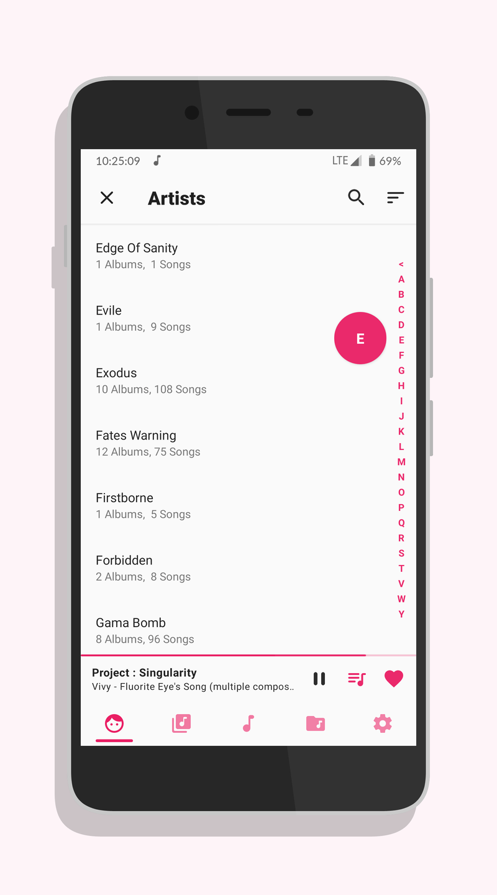

<h1 align="center">Music Player GO</h1>

  <!-- Latest Release -->
    
   <!-- Minimum SDK -->
    
     <!-- Android CI integration -->
    

  <h3 align="center">
  
  </h3>

  <h3 align="center">
  <a href="PRIVACY.md">Privacy policy</a> |
  <a href="FAQ.md">FAQ</a> |
  <a href="CONTRIBUTORS.md">Contributors</a> |
  <a href="FORMATS.md">Formats</a>
  </h3>

  </h3>

# Table of contents

- [Description](#description)
- [Download](#download)
- [Features](#features)
- [Translations](#translations)
- [License](#license)
  - [Authors / Copyleft Copyright](#authors--copyleft-copyright)
  - [Third-party component](#third-party-components)
    - [Libraries](#libraries)
    - [Tools / Graphics](#tools--graphics)
  - [License details](#license-details)

# Description

Source code for the Android music player **Music Player GO**

# Download

  
# Features

- Minimal interface
- Equalizer
- Music organised by artist, albums, songs and folders; tabs are organisable
- Light, dark, automatic themes and accents
- Now playing...
- Embedded covers
- Fast-seeking (by long-clicking the "Skip" buttons)
- Audio focus, precise volume and headset management
- Search, playback speed, sorting, shuffle...
 

# Translations

Help translate the project on [Hosted Weblate](https://hosted.weblate.org/engage/music-player-go/).
Consider supporting the Weblate guys by sending a [donation](https://weblate.org/donate/new/) with our full approval:)

# License

## Authors / Copyleft Copyright

2021 © Enrico D'Ortenzio.

## Third-party components

### Libraries

| Name                                                        | Author                  |
| ----------------------------------------------------------- | ------------------------- |
| [Moshi](https://github.com/square/moshi)                  | [Square](https://square.github.io/)                       |
| [Indicator Fast Scroll](https://github.com/reddit/IndicatorFastScroll)                  | [Reddit](https://github.com/reddit) - [Steven Schoen](https://github.com/DSteve595)                      |
| [material-dialogs](https://github.com/afollestad/material-dialogs)                  | [Aidan Follestad](https://github.com/afollestad)                       |
| [recyclical](https://github.com/afollestad/recyclical)                  | [Aidan Follestad](https://github.com/afollestad)                       |
| [Edge-to-Edge](https://github.com/beworker/edge-to-edge)                  | [Sergej Shafarenka](https://github.com/beworker)                       |
| [coil](https://github.com/coil-kt/coil)                  | [coil-kt](https://github.com/coil-kt)                       |

### Tools / Graphics

| Name                                                        | Author                  |
| ----------------------------------------------------------- | ------------------------- |
| [GIF optimisation-script](https://github.com/mathieu-aubin/tempgif)                  | [Mathieu Aubin](https://github.com/mathieu-aubin)                       |
| [Screener - Better screenshots](https://play.google.com/store/apps/details?id=de.toastcode.screener) | [Toastcode](https://toastco.de/)                       |
| [Round icons](https://material.io/tools/icons/?style=round) | Google                       |
| [sort-alphabetical-descending-variant icon](https://materialdesignicons.com/icon/sort-alphabetical-descending-variant) | Austin Andrews [templatarian](https://twitter.com/templarian)                       |
| [sort-alphabetical-ascending-variant icon](https://materialdesignicons.com/icon/sort-alphabetical-ascending-variant) | Michael Irigoyen [mririgo](https://twitter.com/mririgo)                       |
| [sort-numeric-ascending-variant icon](https://materialdesignicons.com/icon/sort-numeric-ascending-variant) | Michael Irigoyen [mririgo](https://twitter.com/mririgo)                       |
| [sort-numeric-descending-variant icon](https://materialdesignicons.com/icon/sort-numeric-descending-variant) | Michael Irigoyen [mririgo](https://twitter.com/mririgo) 
| [Compact disc icon](https://www.svgrepo.com/svg/181020/compact-disc-music) | [svgrepo.com](https://www.svgrepo.com)                       |
| Badges | [shields.io](https://shields.io/) 
| gifmaker.me | [gifmaker.me](https://gifmaker.me/)

## License details

This repository is copylefted libre software, licensed [GPLv3](https://www.gnu.org/licenses/#GPL), as described in the [LICENSE](LICENSE.md) file.
Use, study, change and share at will; with all.
