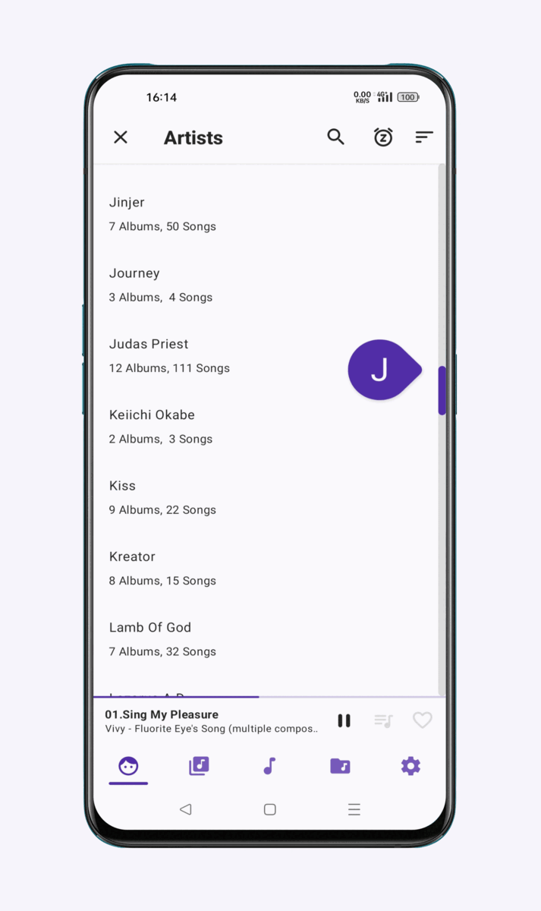

<h1 align="center">Music Player GO</h1>

  <!-- Latest Release -->
    
   <!-- Minimum SDK -->
    
     <!-- Android CI integration -->
    
    <!-- Support Ukraine -->
    

  <h3 align="center">
  
  </h3>

  <h3 align="center">
  <a href="PRIVACY_POLICY.md">Privacy policy</a> |
  <a href="FAQ.md">FAQ</a> |
  <a href="LIBS.md">3rd party components</a> |
  <a href="CONTRIBUTORS.md">Contributors</a> |
  <a href="FORMATS.md">Formats</a>
  </h3>

  </h3>

# Table of contents

- [Description](#description)
- [Download](#download)
- [Features](#features)
- [Translations](#translations)
- [Contributing](#contributing)
- [License](#license)

# Description

Welcome to **Music Player GO**, your go-to local Android music player that strikes the perfect balance between simplicity and performance. Dive into a world where your music is organized intuitively, offering a minimal yet fully-featured experience!

# Download

  
# Features

- Minimal interface
- Equalizer
- Music organised by artist, albums, songs and folders; tabs are organisable
- Light, dark, automatic themes and accents
- Pure black theme
- Queue
- Sleep timer
- Audio focus, precise volume and headset management
- Now playing, embedded covers, search, playback speed, pause on completion, sorting, shuffle, fast-seeking, and more!
 

# Translations

We currently need help translating the project so our app can be more accessible to everyone worldwide!
The image below is an overview of the language translations that are currently being worked on:
- The smaller red bars indicate that there is a significant amount of translating needed
- We would ideally like each language to reach to green (less translations needed)
- Please feel free to add new languages that are not currently being translated

In order to contribute please use [Weblate](https://hosted.weblate.org/engage/music-player-go/). 
You will need to create an account with Weblate (if you don't already have one) in order to do so.

It would also be greatly appreciated if you could send some [love](https://weblate.org/donate/new/) to the Weblate contributors who made easy translations possible :)
By clicking the link, you will be directed to the Weblate monetary donations page, where you will also be prompted to sign in or create an account.

# Contributing

Thank you for considering contributing to Music Player GO! We welcome contributions from the community to help improve and grow this project. Below are some guidelines for front and backend contributions. If you would like to contribut towards translations, please see the above [Translations](#translations) section.

### How to Contribute

* Feel free to submit pull requests for any contributions, using a [feature branch](https://www.atlassian.com/git/tutorials/comparing-workflows/feature-branch-workflow).
* Once you have submitted a pull request, we will need to review and appove it before it can be merged with the project.
* After your contribution has been added we can add you to our list of [contributors](CONTRIBUTORS.md)!
* We would greatly appreciate if you could look at the issues tab to see what needs fixing, especially if there are any bugs!!
* While there is no strict coding style for this project, we encourage you to strive for consistency within the existing codebase and UI following with the minimalistic aesthetic of the application.
* Please make sure to look at the the [FAQ's](FAQ.md), [Privacy Policy](PRIVACY_POLICY.md), [Formats](FORMATS.md), [library's we utilize](LIBS.md), and [our license](LICENSE.md) before you get started to familiairze yourself with our app and frameworks.

To get started, you would need to clone/fork this repository:
- Note *user* refers to your GitHub username

### Windows Terminal commands:

git clone https://github.com/*user*/Music-Player-GO.git

cd Music-Player-GO

### Mac Terminal commands:

git clone https://github.com/*user*/Music-Player-GO.git

cd Music-Player-GO

# License

2022 &copy; **Enrico D'Ortenzio**

This repository is copylefted libre software, licensed [GPLv3](https://www.gnu.org/licenses/#GPL), as described in the [LICENSE](LICENSE.md) file.
Use, study, change and share at will; with all.
