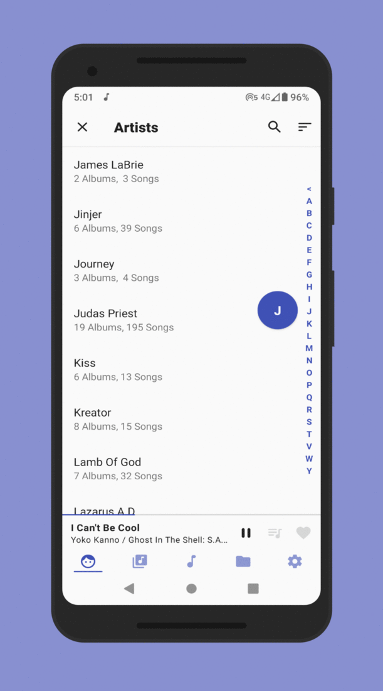

<h1 align="center">Music Player GO</h1>

  <!-- Latest Release -->
    
   <!-- Minimum SDK -->
    

  <h3 align="center">
  
  </h3>

  <h3 align="center">
  <a href="PRIVACY.md">Privacy policy</a> |
  <a href="FAQ.md">FAQ</a> |
  <a href="CONTRIBUTORS.md">Contributors</a> |
  <a href="FORMATS.md">Formats</a>
  </h3>

  </h3>

# Table of contents

- [Description](#description)
- [Download](#download)
- [Features](#features)
- [Translations](#translations)
- [License](#license)
  - [Authors / Copyright](#authors--copyright)
  - [Third-party component licenses](#third-party-component-licenses)
    - [Libraries](#libraries)
    - [Tools](#tools)
  - [License details](#license-details)

# Description

This repo contains the source code of the **Music Player GO** Android app: a simple yet fully-featured local music player aiming at simplicity and performance.

# Download

  
# Features

- Minimalistic interface
- Equalizer
- Music organized by Artist, Albums, Songs and Folders - tabs are organisable
- Personalization: light, dark, automatic themes and accents
- Now playing
- Embedded covers support
- Fast seeking (long click on skip buttons)
- Simple audio focus, precise volume and headsets management
- Other features: search, sorting, shuffle, notification's SeekBar, audios opening from other apps ...
- Modern code base and ... Kotlin!

Want less?
Check [Be Simple Music Player](https://github.com/enricocid/Be-Simple-Music-Player)!
 

# Translations

The project is now hosted on [weblate](https://hosted.weblate.org/engage/music-player-go/). If You want to support weblate guys
please consider a [donation](https://weblate.org/it/donate/new/) :)

# License

## Authors / Copyright

2020 (c) Enrico D'Ortenzio.

## Third-party component licenses

### Libraries

| Name                                                        | Author                  |
| ----------------------------------------------------------- | ------------------------- |
| [Moshi](https://github.com/square/moshi)                  | Square                       |
| [Indicator Fast Scroll](https://github.com/reddit/IndicatorFastScroll)                  | Reddit                       |
| [material-dialogs](https://github.com/afollestad/material-dialogs)                  | [Aidan Afollestad](https://github.com/afollestad)                       |
| [recyclical](https://github.com/afollestad/recyclical)                  | [Aidan Afollestad](https://github.com/afollestad)                       |
| [Edge-to-Edge](https://github.com/beworker/edge-to-edge)                  | [Sergej Shafarenka](https://github.com/beworker)                       |
| [coil](https://github.com/coil-kt/coil)                  | [coil-kt](https://github.com/coil-kt)                       |

### Tools/Graphics

| Name                                                        | Author                  |
| ----------------------------------------------------------- | ------------------------- |
| [GIF optimization script](https://github.com/mathieu-aubin/tempgif)                  | [Mathieu Aubin](https://github.com/mathieu-aubin)                       |
| [Screener - Better screenshots](https://play.google.com/store/apps/details?id=de.toastcode.screener) | [Toastcode](https://toastco.de/)                       |
| [Round icons](https://material.io/tools/icons/?style=round) | Google                       |
| [sort-alphabetical-descending-variant icon](https://materialdesignicons.com/icon/sort-alphabetical-descending-variant) | Austin Andrews [templatarian](https://twitter.com/templarian)                       |
| [sort-alphabetical-ascending-variant icon](https://materialdesignicons.com/icon/sort-alphabetical-ascending-variant) | Michael Irigoyen [mririgo](https://twitter.com/mririgo)                       |
| [sort-numeric-ascending-variant icon](https://materialdesignicons.com/icon/sort-numeric-ascending-variant) | Michael Irigoyen [mririgo](https://twitter.com/mririgo)                       |
| [sort-numeric-descending-variant icon](https://materialdesignicons.com/icon/sort-numeric-descending-variant) | Michael Irigoyen [mririgo](https://twitter.com/mririgo) 
| [Compact disc icon](https://www.svgrepo.com/svg/181020/compact-disc-music) | [svgrepo.com](https://www.svgrepo.com)                       |
| Badges | [shields.io](https://shields.io/) 
| gifmaker.me | [gifmaker.me](https://gifmaker.me/)

## License details

The licence for this repository is a [GNU General Public License, Version 3.0](http://www.gnu.org/licenses/#GPL). Please see the [LICENSE](LICENSE.md) file for full reference.
