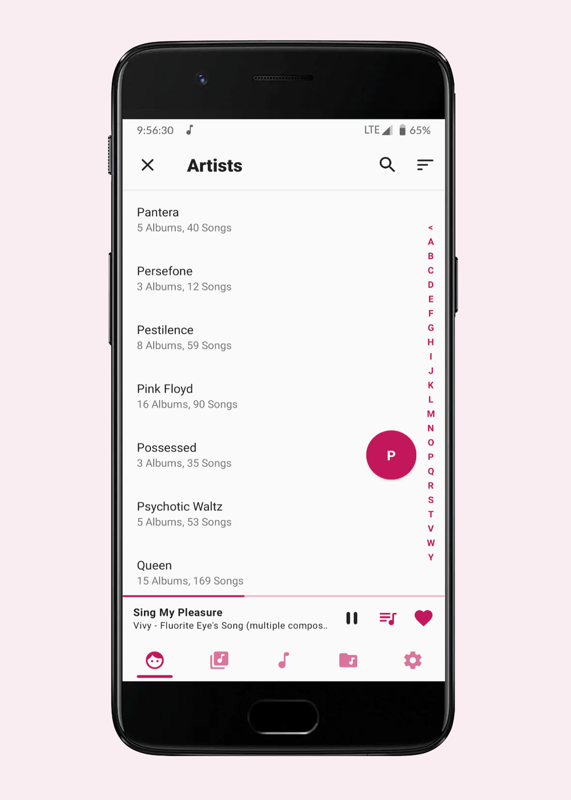

<h1 align="center">Music Player GO</h1>

  <!-- Latest Release -->
    
   <!-- Minimum SDK -->
    
     <!-- Android CI integration -->
    

  <h3 align="center">
  
  </h3>

  <h3 align="center">
  <a href="PRIVACY_POLICY.md">Privacy policy</a> |
  <a href="FAQ.md">FAQ</a> |
  <a href="LIBS.md">3rd party components</a>
  <a href="CONTRIBUTORS.md">Contributors</a> |
  <a href="FORMATS.md">Formats</a>
  </h3>

  </h3>

# Table of contents

- [Description](#description)
- [Download](#download)
- [Features](#features)
- [Translations](#translations)
- [License](#license)

# Description

Home of **Music Player GO**, a minimal yet fully-featured local Android music player aiming at **simplicity** and performance

# Download

  
# Features

- Minimal interface
- Equalizer
- Music organised by artist, albums, songs and folders; tabs are organisable
- Light, dark, automatic themes and accents
- Queue
- Audio focus, precise volume and headset management
- Now playing, embedded covers, search, playback speed, pause on completion, sorting, shuffle, fast-seeking...
 

# Translations

Help us to translate the project on [Hosted Weblate](https://hosted.weblate.org/engage/music-player-go/).
Consider sending some [love](https://weblate.org/donate/new/) to the Weblate guys who made easy translations possible. :)

# License

## License details

This repository is copylefted libre software, licensed [GPLv3](https://www.gnu.org/licenses/#GPL), as described in the [LICENSE](LICENSE.md) file.
Use, study, change and share at will; with all.

## Authors / Copyleft Copyright

2022 &copy; Enrico D'Ortenzio.
